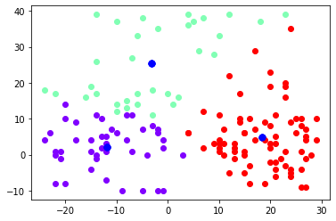

Task 1.


```python
print('Task 1')
```

    Task 1
    


```python
import numpy as np
import matplotlib.pyplot as plt
```


```python
def scatter_clusters(
  centers: list,
  spread: list,
  n_points: int):
  points = [[],[]]
  for i in range(len(centers)):
    Xs = np.random.randint(low = centers[i][0]-spread[i], high = centers[i][0]+spread[i], size=n_points)
    Ys = np.random.randint(low = centers[i][1]-spread[i], high = centers[i][1]+spread[i], size=n_points)
    for i in range(len(Xs)):
      points[0].append(Xs[i])
      points[1].append(Ys[i])
      
  return points
```


```python
centers = [[-10,5], [5,20], [20,1]]
```


```python
centers_x = [i[0] for i in centers]
centers_y = [i[1] for i in centers]
```


```python
easy = scatter_clusters(centers=centers, spread=[5, 7, 5], n_points=50)
hard = scatter_clusters(centers=centers, spread=[15, 20, 10], n_points=50)
```


```python
%matplotlib inline
plt.title("Easy problem for 3 clusters")
plt.plot(easy[0], easy[1], 'o', color='green', markersize=3)
plt.plot(centers_x, centers_y, 'o', color='blue')
plt.show()
```


    

    


```python
%matplotlib inline
plt.title("Hard problem for 3 clusters")
plt.plot(hard[0], hard[1], 'o', color='green', markersize=3)
plt.plot(centers_x, centers_y, 'o', color='blue')
plt.show()
```


    

    


Task 2.


```python
print('Task 2')
```

    Task 2
    


```python
from typing import Optional
```


```python
easy_points = [[x,y] for x,y in zip(easy[0], easy[1])]
```


```python
hard_points = [[x,y] for x,y in zip(hard[0], hard[1])]
```


```python
from collections import defaultdict

def kmeans_cluster_assignment(
  k: int,
  points: list,
  centers_guess: Optional[list] = None,
  max_iterations: Optional[int] = None,
  tolerance: Optional[float] = None):
  if centers_guess == None:
    centers_guess = []
    for i in range(k):
      x = np.random.randint(low = min(points[0]), high = max(points[0]))
      y = np.random.randint(low = min(points[1]), high = max(points[1]))
      centers_guess.append([x,y])
  if max_iterations == None:
    max_iterations = 100
  if tolerance == None:
    tolerance = 0.001
  n_iter = 0
  while n_iter <= max_iterations:
    n_iter += 1
    z = {}
    for p in points:
      p_dists = [np.linalg.norm(np.array(p)-np.array(c)) for c in centers_guess]
      min_dist = min(p_dists)
      min_dist_id = p_dists.index(min_dist)
      if min_dist_id not in z.keys():
        z[min_dist_id] = []
        z[min_dist_id].append(p)
      else:
        z[min_dist_id].append(p)
    new_centers = []
    for i in z.keys():
      new_x = np.mean([p[0] for p in z[i]])
      new_y = np.mean([p[1] for p in z[i]])
      new_centers.append([new_x, new_y])
    if len(new_centers) < k:
      for i in range(k-len(new_centers)):
        x = np.random.randint(low = min(points[0]), high = max(points[0]))
        y = np.random.randint(low = min(points[1]), high = max(points[1]))
        new_centers.append([x,y])
    if np.linalg.norm(np.array(centers_guess) - np.array(new_centers)) <= tolerance:
      break
    centers_guess = new_centers

  return new_centers, z
```


```python
def plot_scattering_with_color(centers, clusters):
  colors = plt.cm.rainbow(np.linspace(0, 1, len(clusters.keys())))
  for cluster, color in zip(clusters, colors):
    xs = [i[0] for i in clusters[cluster]]
    ys = [i[1] for i in clusters[cluster]]
    plt.scatter(xs, ys, c=color.reshape(1,-1))
    plt.scatter(np.array(centers)[:, 0], np.array(centers)[:, 1], c='b', s=50)
  plt.show()
```


```python
for i in [1, 2, 3, 4, 5, 25, 50, 75, None]:
  new_centers, clusters = kmeans_cluster_assignment(3, easy_points, max_iterations=i)
  if i == None:
    print('Max iterations = 100')
  else:
    print('Max iterations = ', i)
  plot_scattering_with_color(new_centers, clusters)
```

    Max iterations =  1
    


    

    


    Max iterations =  2
    


    

    


    Max iterations =  3
    


    

    


    Max iterations =  4
    


    

    


    Max iterations =  5
    


    

    


    Max iterations =  25
    


    

    


    Max iterations =  50
    


    

    


    Max iterations =  75
    


    

    


    Max iterations = 100
    


    

    


```python
for i in [1, 2, 3, 4, 5, 25, 50, 75, None]:
  new_centers, clusters = kmeans_cluster_assignment(3, hard_points, max_iterations=i)
  if i == None:
    print('Max iterations = 100')
  else:
    print('Max iterations = ', i)
  plot_scattering_with_color(new_centers, clusters)
```

    Max iterations =  1
    


    

    


    Max iterations =  2
    


    

    


    Max iterations =  3
    


    

    


    Max iterations =  4
    


    

    


    Max iterations =  5
    


    

    


    Max iterations =  25
    


    

    


    Max iterations =  50
    


    

    


    Max iterations =  75
    


    

    


    Max iterations = 100
    


    

    


Task 3.


```python
print('Task 3')
```

    Task 3
    


```python
%%time
new_centers, clusters = kmeans_cluster_assignment(3, easy_points)
```

    CPU times: user 45.4 ms, sys: 75 µs, total: 45.4 ms
    Wall time: 49.9 ms
    


```python
%%time
new_centers, clusters = kmeans_cluster_assignment(3, hard_points)
```

    CPU times: user 56.2 ms, sys: 950 µs, total: 57.2 ms
    Wall time: 60.8 ms
    


```python
import scipy
from scipy import cluster
from scipy.cluster.vq import vq, kmeans, whiten
```


```python
easy_points_2 = np.array([list(map(float, i)) for i in easy_points])
hard_points_2 = np.array([list(map(float, i)) for i in hard_points])
```


```python
whitened_easy = whiten(easy_points_2)
whitened_hard = whiten(hard_points_2)
```


```python
%%time
codebook, distortion = kmeans(whitened_easy, 3)
```

    CPU times: user 7.54 ms, sys: 0 ns, total: 7.54 ms
    Wall time: 10.9 ms
    


```python
%%time
codebook2, distortion2 = kmeans(whitened_hard, 3)
```

    CPU times: user 14.4 ms, sys: 2.13 ms, total: 16.5 ms
    Wall time: 14 ms
    

Kmeans is the fastest for both easy and hard problems, and the easy problem is solved faster than the hard one in both methods.


```python
#!pip install memory_profiler
%load_ext memory_profiler
```


```python
%%memit
new_centers_e, clusters_e = kmeans_cluster_assignment(3, easy_points)
```

    peak memory: 160.41 MiB, increment: 0.09 MiB
    


```python
%%memit
new_centers_h, clusters_h = kmeans_cluster_assignment(3, hard_points)
```

    peak memory: 160.56 MiB, increment: 0.00 MiB
    


```python
%%memit
codebook_e, distortion_e = kmeans(whitened_easy, 3)
```

    peak memory: 160.56 MiB, increment: 0.00 MiB
    


```python
%%memit
codebook_h, distortion_h = kmeans(whitened_hard, 3)
```

    peak memory: 160.56 MiB, increment: 0.00 MiB
    

As for memory usage, solving the easy problem by the first method takes less memory than by the second one, and solving the hard problem by both methods takes the same memory amount.

Talking about quality, there're plots for the both problems by first method in the Task 2, and they all look pretty fine. So now let's try to plot the kmeans function results.


```python
def get_assing(centers, points):
  z = {}
  for p in points:
    p_dists = [np.linalg.norm(np.array(p)-np.array(c)) for c in centers]
    min_dist = min(p_dists)
    min_dist_id = p_dists.index(min_dist)
    if min_dist_id not in z.keys():
      z[min_dist_id] = []
      z[min_dist_id].append(p)
    else:
      z[min_dist_id].append(p)
  return z
```


```python
def plot_scattering_with_color_2(centers, clusters):
  colors = plt.cm.rainbow(np.linspace(0, 1, len(centers)))
  for cluster, color in zip(clusters, colors):
    xs = [i[0] for i in clusters[cluster]]
    ys = [i[1] for i in clusters[cluster]]
    plt.scatter(xs, ys, c=color.reshape(1,-1))
  plt.show()
```


```python
kmean_clusters_e = get_assing(codebook_e, easy_points)
plot_scattering_with_color_2(codebook_e, kmean_clusters_e)
```


    

    


```python
kmean_clusters_h = get_assing(codebook_h, hard_points)
plot_scattering_with_color_2(codebook_h, kmean_clusters_h)
```


    

    


It seems that the clusters we got by the first method are more balanced than the ones we got by sklearn kmean function but anyway there're no lonely points of one color in the bunch of points of the other color so they're all grouped well.
